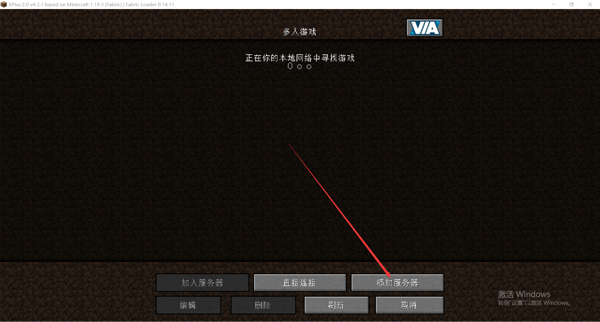
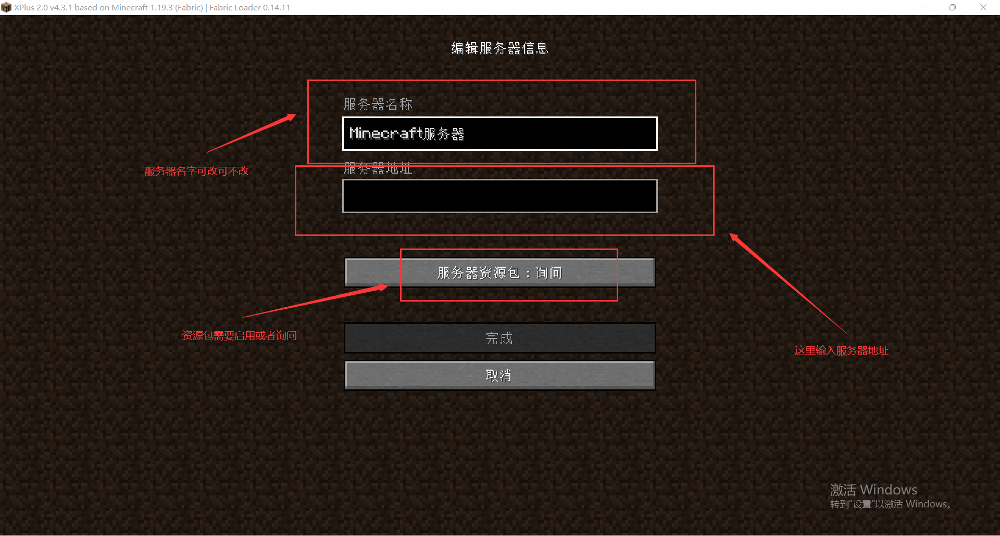
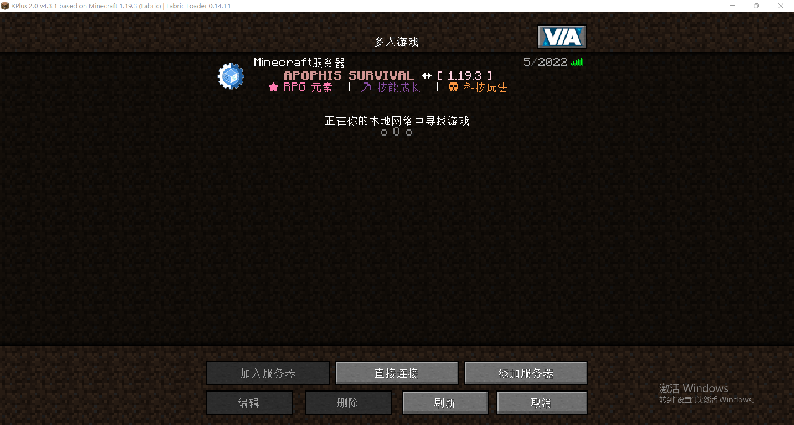
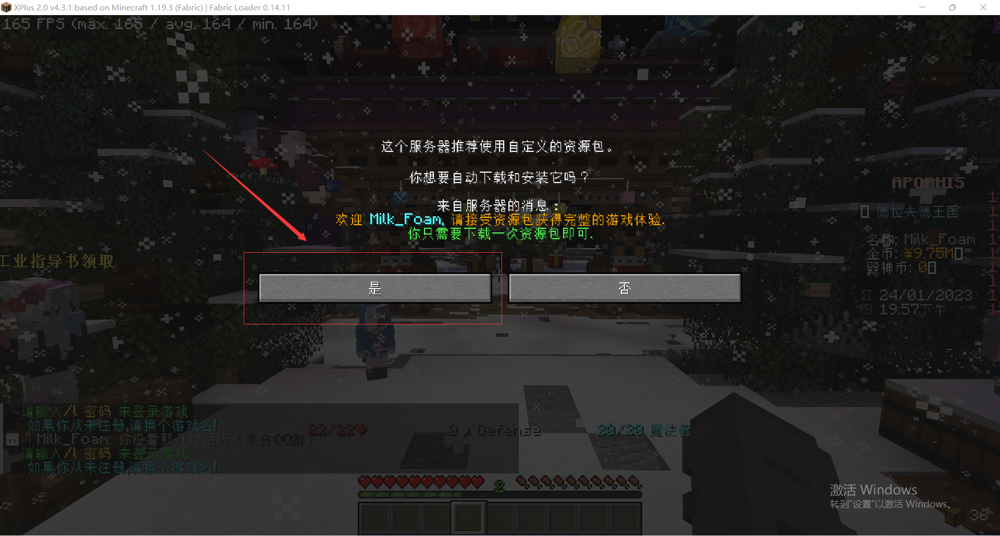
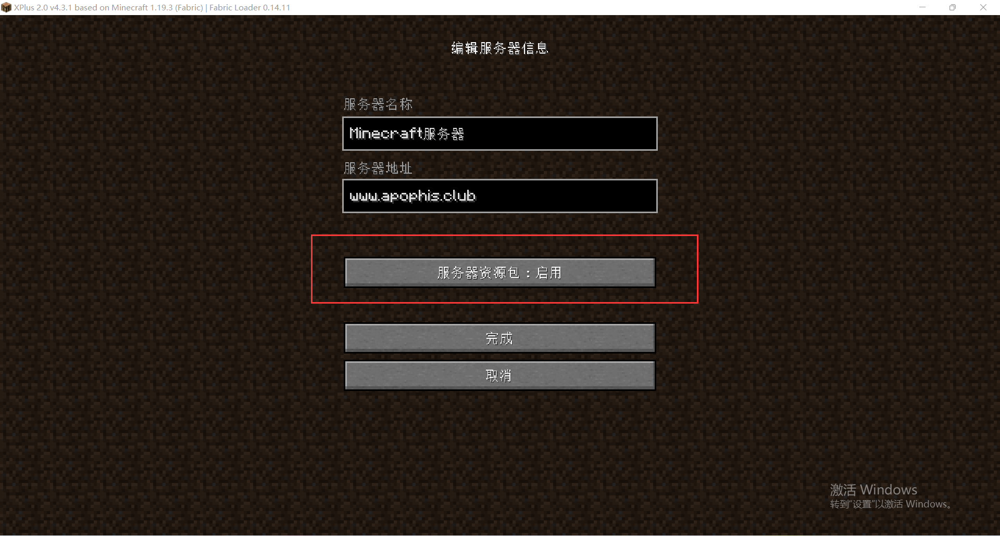
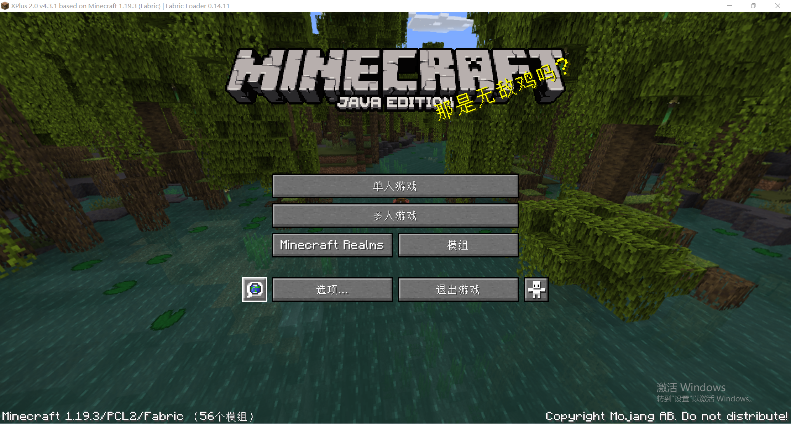
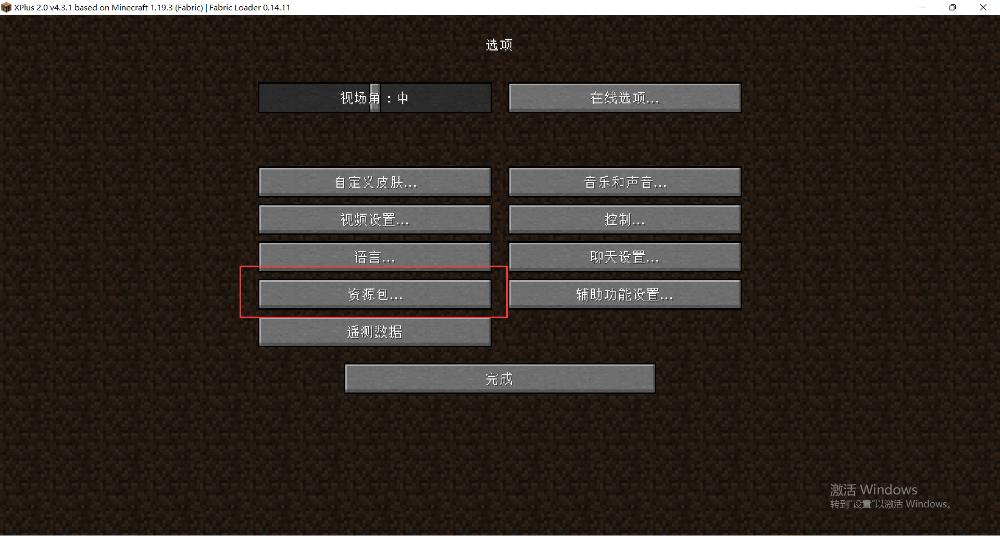
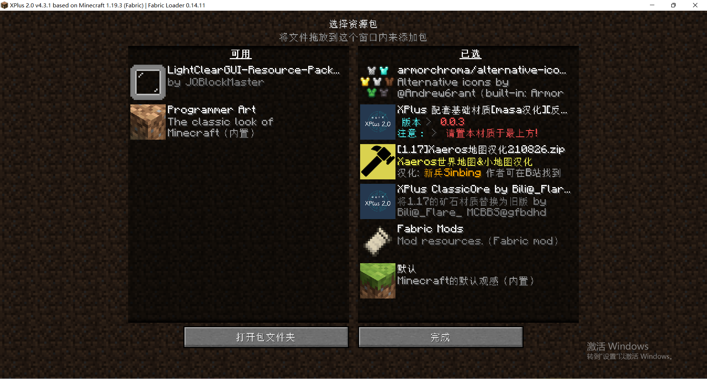

# 基础教程与常识

## 如何开始游戏

- 加入服务器官方QQ群下载客户端: **[765667219](https://jq.qq.com/?_wv=1027&k=zqd2jeKi)**
- 前往百度网盘下载客户端: **[点击前往](https://pan.baidu.com/s/1Q1rYNnrsEUBzjJ-7AQu75Q?pwd=u39j)**
- 自行下载 `1.19.3` 的客户端然后在服务器列表输入 `www.apophis.club` 即可进入游戏

自行下载的客户端如何开始游戏

## 游戏内常用指令
- /menu - 打开菜单
- /tpa - tp到其他在线玩家
- /home - 回私人传送点
- /sethome - 设置私人传送点
- /delhome - 删除私人传送点
- /msg /tell /m - 私聊其他玩家
- /pay 玩家id 钱 - 给指定玩家汇款

<!-- :::tip

`更多合成表`会在后续wiki项目更新 
以及进服会自动给予`space`和`nova`的合成书

:::   -->

## 材质包加载问题以及注意事项

- 由于服务器主要由`ItemsAdder`插件制作，所以玩家如果需要获得更好的体验，需要同意服务器的材质包远程加载  
- 考虑到有些玩家`不游玩工业类型`，可以在官方QQ群**[765667219](https://jq.qq.com/?_wv=1027&k=zqd2jeKi)**或者**[腾讯微云](https://share.weiyun.com/4ygwfEGi)**中下载`无工业的材质包`并安装在本地

远程加载材质包方法以及注意事项

### 进入服务器时会询问你是否加载材质包
选择 `是` 即可下次进服务器时候会默认这个选项

### 我不小心点了否怎么办？
退出服务器进入服务器编辑界面把服务器资源包 `启用` 即可

本地加载材质包方法以及注意事项

### 在上方链接中下载资源包后，进入材质包界面启用材质包即可

材质包其他问题

### 游戏界面有乱码
请 `按ESC` 选择 `语言` 设置 `强制使用Unicode字体`：`关闭`

  

