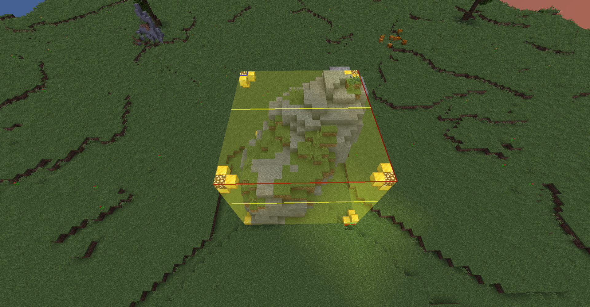

# 领地用法与注意事项

## 如何圈地

- 前往 `毁神星` 后
- 手持 木锹 左键方块以选取第一个点
- 右键方块以选取第二个点
- 右键后点击绿色羊毛即可完成创建

:::info 

圈地插件支持 **[WorldEditCUI](https://www.mcmod.cn/class/612.html)** Mod  
建议玩家加入此Mod获得更好的体验

:::
:::info 

圈地只允许在毁神星及其衍生世界  
其他世界禁止圈地

:::
:::caution 圈地注意事项

点击的方块和圈地之后会暂时更改方块  
等到全部圈地完成之后，方块会自动复原，所以请不要反馈此问题

点击查看示例

:::
:::caution 领地权限注意事项

怪物生成: 为  `否`  时会让被感染的村民、生成后的凋灵直接消失  
伤害动物: 为  `否`  时村民无法被僵尸感染  
村民务农: 先前领地插件不具有的设置, 为 `否` 时村民不会收菜  

:::

## 子领地
#### 创建:
- 执行命令 /gd mode subdivide
- 与创建领地操作一样, 木锹选取2个点
- 执行命令 /gd create chunk subdivision
#### 用途:
- 在一个领地内创建一个“特权区”
- 如想让领地内的小片区域可以生成怪物

## 领地常用指令
- /claimsetspawn - 设置所处领地的传送点
- /claimspawn 领地名 - 传送至指定领地（需已设置传送点）
- /claimlist 玩家名 - 列出指定玩家的所有领地（仅显示自身拥有权限的领地 玩家名选项默认值为自身）
- /cf - 设置领地权限
- /abandon - 删除自己脚下的领地
- /abandonall - 删除自己的所有领地
- /claimgui - 在聊天栏/界面之间切换信息显示方式
- /untrust 玩家 - 取消指定玩家在当前领地的身份
- /untrustall - 取消指定玩家在你所拥有的全部领地的身份
- /basicclaims - 切换到普通圈地模式
- /subdivideclaims - 切换到子领地圈地模式
- /townclaims - 切换到圈地模式
- /claiminfo - 查看脚下的领地信息

:::tip 普通圈地模式

2D 模式下的 5x5 大小限制  
3D 模式下的 5x5x5 大小限制  
领地可以出售、出租或转让给其他玩家

:::  

:::tip 子领地圈地模式

2D 模式下的 1x1 大小限制  
3D 模式下的 1x1x1 大小限制  
子领地可以出售、出租或转让给其他玩家

:::  

:::tip 小镇圈地模式

2D 模式下的 32x32 大小限制  
3D 模式下的 32x32x32 大小限制

:::  

## 领地信任指令

公众: 尚未得到任何身份和权限的玩家
Accessor: 授予玩家/身份组与除库存以外的所有方块互动的权限  
Container: 授予玩家/身份组与所有方块互动的权限，包括库存  
Builder: 授予玩家/身份组编辑权限，包括放置和破坏方块的能力，以实现上述所有功能，默认信任就是给这个组
Manager: 授予玩家/身份组对上述所有内容的访问权，包括修改领地的能力 

- /trust 玩家 身份组 - 将指定玩家加入到当前领地的指定身份组内（身份组放空则为builder）
- /trustall 玩家 身份组 - 将指定玩家加入到你所拥有的全部领地的指定身份组内（身份组放空则为builder）
- /trustlist - 列出当前受信任的玩家和信任类型

:::info

注意: 如果你想移除信任, `type` 为 `none` 即可
 

:::

