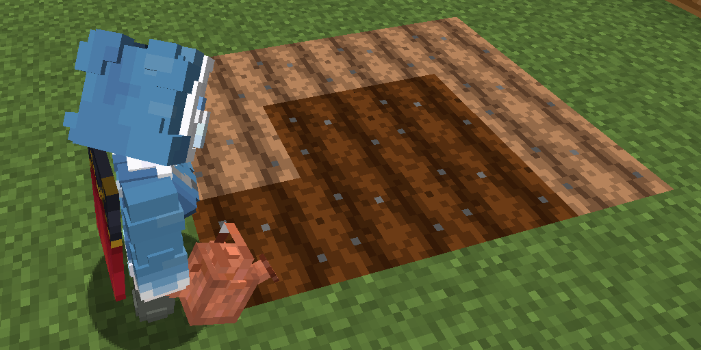

# 星露谷物语

### 1.季节系统:
- 允许种植星露谷作物的世界拥有季节系统
- 季节分为春夏秋冬，一季29天
- 季节仅仅是为了限制作物种植期
### 2.种植盆:
- 通过配方合成种植盆
- 手持星露谷作物种子右键种植盆即可播种
- 手持洒水壶右键种植盆以浇水
- 种植作物前可使用肥料缩短作物生长周期
- 作物生长时可使用保水剂使该种植盆在短期内无需再次浇水

种植盆相关图片

### 3.作物生长:
- 作物每20分钟会尝试生长, 尝试生长会耗尽土壤水分, 消耗土壤养分
- 作物若在尝试，所处种植盆为干枯状态，则不会有任何生长进度
- 累计三天干枯将枯死
- 作物一般分为俩种生长模式
  - 一种是成熟后每隔一段时间可反复收获，无需重新种植，类似于原版西瓜
  - 另一种，收获后需重新播种，与原版土豆一致
- 季节更替时，不适应下一季节的作物将全部枯死
- 不同作物生长周期不同

作物相关图片

### 4.作物收获:
- 作物收获后玩家会根据概率获得优质/普通/劣质作物
- 不同作物成熟后可收获到的数量不同，如土豆可收获1-4个，菠菜固定一个

作物相关图片

### 5.乌鸦与稻草人:
- 乌鸦每40分钟会尝试袭击玩家的庄稼, 强行毁坏玩家的一株作物
- 通过建造稻草人以自动赶跑8x8区域内的乌鸦

乌鸦和稻草人相关图片

### 6.肥料/保土/增产道具:
- 通过商店获取多种农用品, 农用品一般持续至作物收获1
- 肥料: 播种前使用(高级肥料可随时使用), 提升获得高品质作物的概率
- 保土袋: 令作物生长不完全耗尽土壤水分
- 增产药: 增加作物收获产出量
- 催化剂: 加速作物生长
- 魔法瓶: 概率使作物结出黄金果实（若拥有）

道具相关图片

    

